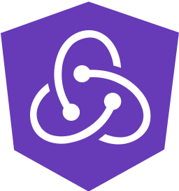

<p align="center">
  
</p>

[]()
[](#contributors-)

# ngrx-rtk-query

`ngrx-rtk-query` brings RTK Query to Angular applications with signal-based generated hooks. It keeps RTK Query endpoint definitions, caching, invalidation, lazy queries, mutations, and infinite queries, then exposes Angular-friendly APIs for components and NgRx Signal Store.

Use it when you want RTK Query's data-fetching model in Angular without writing React hooks or RxJS wrappers.

## Contents

- [Quick Start](#quick-start)
- [Install](#install)
- [Version Compatibility](#version-compatibility)
- [Core Concepts](#core-concepts)
- [Runtime Choices](#runtime-choices)
- [Import Paths](#import-paths)
- [Define an API](#define-an-api)
- [Cache Tags and Invalidation](#cache-tags-and-invalidation)
- [Mount the API](#mount-the-api)
- [Use Queries](#use-queries)
- [Query Options and Refetching](#query-options-and-refetching)
- [Use Lazy Queries](#use-lazy-queries)
- [Use Prefetch](#use-prefetch)
- [Use Infinite Queries](#use-infinite-queries)
- [Use Mutations](#use-mutations)
- [Use Signal Store Readers](#use-signal-store-readers)
- [Use Angular DI in Base Queries](#use-angular-di-in-base-queries)
- [Code Splitting and Lazy Routes](#code-splitting-and-lazy-routes)
- [Testing](#testing)
- [Examples](#examples)
- [Troubleshooting](#troubleshooting)
- [Maintainers](#maintainers)
- [Contributors](#contributors-)

## Quick Start

1. Install `ngrx-rtk-query` and `@reduxjs/toolkit`.
2. Install `@ngrx/store` only for the NgRx Store runtime, or `@ngrx/signals` only for the Signal Store runtime. Noop Store has no extra NgRx peer.
3. Define one RTK Query API with `createApi(...)`.
4. Mount that API once with `provideStoreApi(api)`, `provideNoopStoreApi(api)`, or `withApi(api)`.
5. Use the generated Angular hooks from the API: `useGetPostsQuery`, `useLazyGetPostsQuery`, `useAddPostMutation`, or `useGetPostsInfiniteQuery`.

For most Angular apps, the shortest setup is:

```ts
import { createApi, fetchBaseQuery } from 'ngrx-rtk-query';

type Post = { id: number; name: string };

export const postsApi = createApi({
  reducerPath: 'postsApi',
  baseQuery: fetchBaseQuery({ baseUrl: '/api' }),
  endpoints: (build) => ({
    getPosts: build.query<Post[], void>({
      query: () => '/posts',
    }),
  }),
});

export const { useGetPostsQuery } = postsApi;
```

Then mount it with the runtime that matches the app:

```ts
import { provideNoopStoreApi } from 'ngrx-rtk-query/noop-store';

providers: [provideNoopStoreApi(postsApi)];
```

## Install

Install the package and RTK Query:

```bash
npm install ngrx-rtk-query @reduxjs/toolkit
```

Install the runtime peer you use:

```bash
# NgRx Store runtime
npm install @ngrx/store

# NgRx Signal Store runtime
npm install @ngrx/signals
```

`@ngrx/store` and `@ngrx/signals` are optional peer dependencies. Install only the runtime you use.

## Version Compatibility

Library majors track Angular majors.

| Angular | NgRx runtime | ngrx-rtk-query | @reduxjs/toolkit |    Support    |
| :-----: | :----------: | :------------: | :--------------: | :-----------: |
|  21.x   |    21.1+     |     21.1+      |     ~2.11.2      |    Active     |
|  20.x   |     20.x     |      20.x      |      ~2.9.0      |     Bugs      |
|  18.x   |    18.2+     |     18.2+      |      ~2.6.0      |     Bugs      |
|  18.x   |    18.1+     |     18.1+      |      ~2.5.0      |     Bugs      |
|  18.x   |    18.0+     |     18.0+      |      ~2.2.5      | Critical bugs |
|  17.x   |    17.1+     |     17.1+      |      ~2.2.1      | Critical bugs |
|  16.x   |     n/a      |      4.2+      |      ~1.9.3      | Critical bugs |
|  15.x   |     n/a      |     4.1.x      |      1.9.3       |     None      |

Only the latest Angular major in this table is actively supported. Angular libraries are compiled against Angular's major-version compatibility contract.

## Core Concepts

- **API instance:** the object returned by `createApi(...)`. It owns endpoint definitions, cache identity, generated hooks, selectors, utilities, and dispatch.
- **Runtime host:** the Angular integration that mounts an API instance. Use exactly one host per API instance.
- **Generated hook:** an Angular-friendly function generated from an endpoint name, such as `useGetPostsQuery` or `useAddPostMutation`.
- **Fine-grained signals:** hook result fields are callable signals. Prefer `query.data()` or `query.isLoading()` when reading one field.
- **Endpoint injection:** use `api.injectEndpoints(...)` for lazy routes or feature-owned endpoints that share the same base API and cache.

Most RTK Query endpoint features still come from `@reduxjs/toolkit/query`: `query`, `queryFn`, tags, cache keys, `transformResponse`, `onQueryStarted`, `onCacheEntryAdded`, polling, refetch options, and invalidation semantics. This package adapts the hook and runtime layer to Angular.

## Runtime Choices

Choose one runtime host per API instance.

| Runtime           | Use when                                                                    | Mount with                                                  |
| ----------------- | --------------------------------------------------------------------------- | ----------------------------------------------------------- |
| NgRx Store        | The application already uses NgRx Store or wants Redux DevTools integration | `provideStoreApi(api)` from `ngrx-rtk-query/store`          |
| Noop Store        | The application does not use NgRx Store                                     | `provideNoopStoreApi(api)` from `ngrx-rtk-query/noop-store` |
| NgRx Signal Store | You want an API mounted inside a Signal Store feature                       | `withApi(api)` from `ngrx-rtk-query/signal-store`           |

Signal Store readers can be composed separately with `withApiState(api)` as long as the same API instance is mounted somewhere in the app.

## Import Paths

Core APIs:

```ts
import { createApi, fetchBaseQuery, skipToken } from 'ngrx-rtk-query';
```

Store-agnostic core entrypoint:

```ts
import { createApi, fetchBaseQuery, skipToken } from 'ngrx-rtk-query/core';
```

NgRx Store runtime:

```ts
import { provideStoreApi } from 'ngrx-rtk-query/store';
```

Noop Store runtime:

```ts
import { provideNoopStoreApi } from 'ngrx-rtk-query/noop-store';
```

NgRx Signal Store runtime:

```ts
import { withApi, withApiState } from 'ngrx-rtk-query/signal-store';
```

`provideStoreApi` is still available from `ngrx-rtk-query` during a deprecation window. Prefer `ngrx-rtk-query/store` for new code. Applications that do not install `@ngrx/store` can import core APIs from `ngrx-rtk-query/core` to avoid resolving the deprecated root store-provider export.

## Define an API

Define endpoints with RTK Query's `createApi` model:

```ts
import { createApi, fetchBaseQuery } from 'ngrx-rtk-query';

export interface Post {
  id: number;
  name: string;
}

export const postsApi = createApi({
  reducerPath: 'postsApi',
  baseQuery: fetchBaseQuery({ baseUrl: 'https://example.com/api' }),
  tagTypes: ['Posts'],
  endpoints: (build) => ({
    getPosts: build.query<Post[], void>({
      query: () => '/posts',
      providesTags: (result) =>
        result
          ? [...result.map(({ id }) => ({ type: 'Posts' as const, id })), { type: 'Posts', id: 'LIST' }]
          : [{ type: 'Posts', id: 'LIST' }],
    }),
    getPost: build.query<Post, number>({
      query: (id) => `/posts/${id}`,
      providesTags: (_result, _error, id) => [{ type: 'Posts', id }],
    }),
    addPost: build.mutation<Post, Partial<Post>>({
      query: (body) => ({ url: '/posts', method: 'POST', body }),
      invalidatesTags: [{ type: 'Posts', id: 'LIST' }],
    }),
  }),
});

export const { useGetPostsQuery, useGetPostQuery, useAddPostMutation } = postsApi;
```

## Cache Tags and Invalidation

Use RTK Query tags the same way you would in Redux Toolkit. Queries provide tags; mutations invalidate tags; invalidated active queries refetch through the mounted runtime host.

```ts
export const postsApi = createApi({
  reducerPath: 'postsApi',
  baseQuery: fetchBaseQuery({ baseUrl: '/api' }),
  tagTypes: ['Posts'],
  endpoints: (build) => ({
    getPosts: build.query<Post[], void>({
      query: () => '/posts',
      providesTags: (result) =>
        result
          ? [...result.map(({ id }) => ({ type: 'Posts' as const, id })), { type: 'Posts', id: 'LIST' }]
          : [{ type: 'Posts', id: 'LIST' }],
    }),
    updatePost: build.mutation<Post, Partial<Post> & Pick<Post, 'id'>>({
      query: ({ id, ...patch }) => ({ url: `/posts/${id}`, method: 'PATCH', body: patch }),
      invalidatesTags: (_result, _error, { id }) => [
        { type: 'Posts', id },
        { type: 'Posts', id: 'LIST' },
      ],
    }),
  }),
});
```

Use one API instance when endpoints share a cache and tag model. Create another API only for a different base URL, cache identity, or runtime host requirement.

## Mount the API

### NgRx Store

Use this when the app already uses NgRx Store:

```ts
import { bootstrapApplication } from '@angular/platform-browser';
import { provideStore } from '@ngrx/store';

import { provideStoreApi } from 'ngrx-rtk-query/store';

import { AppComponent } from './app/app.component';
import { postsApi } from './app/posts/api';

bootstrapApplication(AppComponent, {
  providers: [provideStore(), provideStoreApi(postsApi)],
});
```

Pass `{ setupListeners: false }` when you do not want RTK Query focus and reconnect listeners.

```ts
provideStoreApi(postsApi, { setupListeners: false });
```

### Noop Store

Use this when the app does not use NgRx Store:

```ts
import { bootstrapApplication } from '@angular/platform-browser';

import { provideNoopStoreApi } from 'ngrx-rtk-query/noop-store';

import { AppComponent } from './app/app.component';
import { postsApi } from './app/posts/api';

bootstrapApplication(AppComponent, {
  providers: [provideNoopStoreApi(postsApi)],
});
```

### Signal Store Host

Use `withApi(api)` to mount an API inside a Signal Store:

```ts
import { signalStore } from '@ngrx/signals';

import { withApi } from 'ngrx-rtk-query/signal-store';

import { postsApi } from './posts/api';

export const PostsApiStore = signalStore({ providedIn: 'root' }, withApi(postsApi));
```

Each API instance must be mounted once. Do not mount the same API instance in multiple runtime hosts.

## Use Queries

Generated query hooks return a signal-like object with fine-grained signal properties.

```ts
import { ChangeDetectionStrategy, Component } from '@angular/core';

import { useGetPostsQuery } from './api';

@Component({
  selector: 'app-posts-list',
  changeDetection: ChangeDetectionStrategy.OnPush,
  template: `
    @if (postsQuery.isLoading()) {
      <p>Loading...</p>
    }

    @if (postsQuery.data(); as posts) {
      @for (post of posts; track post.id) {
        <a [routerLink]="['/posts', post.id]">{{ post.name }}</a>
      }
    }
  `,
})
export class PostsListComponent {
  postsQuery = useGetPostsQuery();
}
```

Arguments and options can be static values, Angular signals, or functions.

```ts
postQuery = useGetPostQuery(this.postId);

postQuery = useGetPostQuery(() => this.postId());

postQuery = useGetPostQuery(
  () => this.postId(),
  () => ({ pollingInterval: this.pollingEnabled() ? 5000 : 0 }),
);
```

Use `skipToken` for conditional queries.

```ts
import { input } from '@angular/core';
import { skipToken } from 'ngrx-rtk-query';

export class PostDetailsComponent {
  postId = input<number | undefined>();

  postQuery = useGetPostQuery(() => this.postId() ?? skipToken);
}
```

Use `selectFromResult` when a component needs a selected view of cached state. It follows RTK Query semantics: only the fields you return are exposed.

```ts
selectedPostQuery = useGetPostsQuery(undefined, {
  selectFromResult: ({ data, isFetching }) => ({
    post: data?.find((post) => post.id === this.postId()),
    isFetching,
  }),
});

selectedPostQuery.post();
selectedPostQuery.isFetching();
```

Prefer `query.isLoading()` over `query().isLoading` when you only need one field. Fine-grained signals reduce unnecessary Angular change detection work.

## Query Options and Refetching

Query, lazy query, infinite query, and mutation options can be plain objects, Angular signals, or functions. Use the reactive forms when route params, component inputs, or local signals control cache subscription behavior.

Common query options:

| Option                      | Use when                                                                                       |
| --------------------------- | ---------------------------------------------------------------------------------------------- |
| `skip`                      | A query should stay unsubscribed until a condition is true.                                    |
| `skipToken`                 | The query argument itself is unavailable yet.                                                  |
| `pollingInterval`           | Active subscribers should poll on an interval.                                                 |
| `skipPollingIfUnfocused`    | Polling should pause while the browser window is unfocused.                                    |
| `refetchOnMountOrArgChange` | A subscriber should refetch on mount or after the cached value is older than a threshold.      |
| `refetchOnFocus`            | A subscriber should refetch after window focus. Requires runtime listeners to be enabled.      |
| `refetchOnReconnect`        | A subscriber should refetch after network reconnect. Requires runtime listeners to be enabled. |
| `selectFromResult`          | A component only needs a selected subset of cached state.                                      |

Manual refetch is available on query hooks:

```ts
postsQuery = useGetPostsQuery();

refresh() {
  this.postsQuery.refetch();
}
```

Focus and reconnect refetching use RTK Query runtime listeners. They are enabled by default in runtime providers and can be disabled with `{ setupListeners: false }`.

## Use Lazy Queries

Lazy query hooks return a trigger object instead of a tuple.

```ts
export class SearchComponent {
  searchPosts = useLazyGetPostsQuery();

  runSearch() {
    this.searchPosts(undefined).unwrap();
  }

  reset() {
    this.searchPosts.reset();
  }
}
```

Lazy query options can also be static values, signals, or functions.

```ts
searchPosts = useLazyGetPostsQuery(() => ({
  selectFromResult: ({ data, isFetching }) => ({
    firstPost: data?.[0],
    isFetching,
  }),
}));
```

Use `preferCacheValue` to avoid dispatching a request when the same arg is already cached.

```ts
this.searchPosts(undefined, { preferCacheValue: true });
```

Lazy query trigger objects expose query-state signals and lazy-query helpers such as `lastArg()` and `reset()`.

## Use Prefetch

Every API exposes `usePrefetch(endpointName, options?)`. It returns a function that dispatches RTK Query prefetch for the selected endpoint.

```ts
export class PostsLinkComponent {
  prefetchPost = postsApi.usePrefetch('getPost', { ifOlderThan: 60 });

  warmPost(id: number) {
    this.prefetchPost(id);
  }
}
```

Use prefetch for hover, viewport, or navigation preparation. Use a query hook when the component needs subscribed state.

## Use Infinite Queries

Infinite queries cache multiple pages inside one cache entry.

```ts
import { computed } from '@angular/core';
import { createApi, fetchBaseQuery } from 'ngrx-rtk-query';

type Pokemon = { id: string; name: string };

export const pokemonApi = createApi({
  reducerPath: 'pokemonApi',
  baseQuery: fetchBaseQuery({ baseUrl: 'https://example.com/pokemon' }),
  endpoints: (build) => ({
    getPokemon: build.infiniteQuery<Pokemon[], string, number>({
      infiniteQueryOptions: {
        initialPageParam: 1,
        getNextPageParam: (_lastPage, _allPages, lastPageParam) => lastPageParam + 1,
        getPreviousPageParam: (_firstPage, _allPages, firstPageParam) =>
          firstPageParam > 1 ? firstPageParam - 1 : undefined,
      },
      query: ({ queryArg, pageParam }) => `/type/${queryArg}?page=${pageParam}`,
    }),
  }),
});

export const { useGetPokemonInfiniteQuery } = pokemonApi;

export class PokemonListComponent {
  pokemonQuery = useGetPokemonInfiniteQuery('fire');

  allResults = computed(() => this.pokemonQuery.data()?.pages.flat() ?? []);

  loadMore() {
    this.pokemonQuery.fetchNextPage();
  }
}
```

The hook exposes RTK Query infinite-query state including `data.pages`, `data.pageParams`, `hasNextPage`, `hasPreviousPage`, `isFetchingNextPage`, `isFetchingPreviousPage`, `fetchNextPage()`, and `fetchPreviousPage()`.

## Use Mutations

Mutation hooks return a trigger object with mutation-state signals.

```ts
export class AddPostComponent {
  addPost = useAddPostMutation();

  async save() {
    const createdPost = await this.addPost({ name: 'New post' }).unwrap();
    console.log(createdPost.id);
  }
}
```

Read mutation state directly:

```ts
this.addPost.isLoading();
this.addPost.isSuccess();
this.addPost.isError();
this.addPost.data();
this.addPost.error();
```

Mutation options can be static values, signals, or functions. This is useful for route-scoped `fixedCacheKey` values.

```ts
updatePost = useUpdatePostMutation(() => ({
  fixedCacheKey: `updatePost:${this.postId()}`,
}));
```

Without `fixedCacheKey`, mutation state is scoped to the trigger instance and exposes its own `originalArgs`. Use `reset()` to clear local mutation state.

```ts
this.addPost.reset();
```

Mutation hooks also support `selectFromResult`. Returned keys are exposed as signals while trigger methods such as `unwrap()` and `reset()` remain available on the trigger object.

## Use Signal Store Readers

Use `withApiState(api)` to expose generated state-reader methods in an NgRx Signal Store. The API can be mounted by `withApi(api)`, `provideStoreApi(api)`, or `provideNoopStoreApi(api)`.

```ts
import { computed } from '@angular/core';
import { signalStore, withComputed, withProps } from '@ngrx/signals';

import { withApi, withApiState } from 'ngrx-rtk-query/signal-store';

import { postsApi } from './posts/api';

export const PostsStore = signalStore(
  { providedIn: 'root' },
  withApi(postsApi),
  withApiState(postsApi),
  withProps((store) => ({
    selectedPostsState: store.getPostsState(),
  })),
  withComputed(({ selectedPostsState }) => ({
    selectedPostsCount: computed(() => selectedPostsState().data?.length ?? 0),
  })),
);
```

Reader stores can be separate from the host:

```ts
export const PostsReaderStore = signalStore(
  { providedIn: 'root' },
  withApiState(postsApi),
  withProps((store) => ({
    selectedPostsState: store.getPostsState(),
  })),
  withComputed(({ selectedPostsState }) => ({
    selectedPostsCount: computed(() => selectedPostsState().data?.length ?? 0),
  })),
);
```

Generated `...State()` methods return the same signal as `api.selectSignal(endpoint.select(...))`. They capture the endpoints available when `withApiState(api)` is composed. If the API is later extended with `api.injectEndpoints(...)`, compose `withApiState(extendedApi)` in a new store to expose the new endpoint readers.

Rules:

- Mount each API instance once.
- Each `withApi(api)` in the same Signal Store host must use a unique `reducerPath`.
- Add `withApiState(api)` only once per API instance in a store.
- Distinct APIs in the same store must not generate the same `...State()` method name.
- Mutation reader methods require a non-empty `fixedCacheKey`, because RTK Query mutation state is otherwise scoped to a trigger request.

## Use Angular DI in Base Queries

`fetchBaseQuery` can receive a factory function. Use it when a base query needs Angular injection.

```ts
import { HttpClient, HttpErrorResponse } from '@angular/common/http';
import { inject } from '@angular/core';
import { createApi, fetchBaseQuery } from 'ngrx-rtk-query';
import { lastValueFrom } from 'rxjs';

const httpClientBaseQuery = fetchBaseQuery((http = inject(HttpClient)) => {
  return async (args) => {
    const request = typeof args === 'string' ? { url: args } : args;
    const { url, method = 'GET', body, params } = request;

    try {
      const data = await lastValueFrom(http.request(method, url, { body, params }));
      return { data };
    } catch (error) {
      const httpError =
        error instanceof HttpErrorResponse
          ? error
          : new HttpErrorResponse({ error, status: 0, statusText: 'Unknown Error' });
      return { error: { status: httpError.status, data: httpError.message } };
    }
  };
});

export const api = createApi({
  reducerPath: 'api',
  baseQuery: httpClientBaseQuery,
  endpoints: (build) => ({
    // endpoints
  }),
});
```

Keep boundary error shapes explicit. RTK Query expects base queries to return `{ data }` or `{ error }`.

## Code Splitting and Lazy Routes

For the same base API, prefer RTK Query endpoint injection:

```ts
export const baseApi = createApi({
  reducerPath: 'api',
  baseQuery: fetchBaseQuery({ baseUrl: '/api' }),
  endpoints: () => ({}),
});

export const postsApi = baseApi.injectEndpoints({
  endpoints: (build) => ({
    getPosts: build.query<Post[], void>({
      query: () => '/posts',
    }),
  }),
});

export const { useGetPostsQuery } = postsApi;
```

Mount the base API once near the app shell. Lazy routes can import the extended API and generated hooks for their endpoints.

Create a separate API only when the feature has a different base URL, cache identity, or runtime host requirement.

## Testing

Test library behavior through public APIs:

```ts
import { provideStore } from '@ngrx/store';
import { render, screen } from '@testing-library/angular';

import { provideStoreApi } from 'ngrx-rtk-query/store';

await render(PostsListComponent, {
  providers: [provideStore(), provideStoreApi(postsApi)],
});

expect(await screen.findByRole('link', { name: /sample/i })).toBeInTheDocument();
```

Reset RTK Query cache between tests when a test shares an API instance:

```ts
afterEach(() => {
  postsApi.dispatch(postsApi.util.resetApiState());
});
```

Use the repository examples as consumer-style references:

- `examples/basic-ngrx-store`
- `examples/basic-noop-store`
- `examples/basic-signal-store`

## Examples

Run the example apps from the repository root:

```bash
pnpm dev:basic-store
pnpm dev:noop-store
pnpm dev:signal-store
```

Example coverage:

| Example              | Demonstrates                                                     |
| -------------------- | ---------------------------------------------------------------- |
| `basic-ngrx-store`   | NgRx Store provider, generated hooks, MSW-backed component tests |
| `basic-noop-store`   | Noop Store provider without NgRx Store                           |
| `basic-signal-store` | `withApi(api)` and `withApiState(api)`                           |
| `*-e2e` examples     | Playwright runtime smoke coverage                                |

## Troubleshooting

| Symptom                                                    | Check                                                                                                                   |
| ---------------------------------------------------------- | ----------------------------------------------------------------------------------------------------------------------- |
| `Provide the API is necessary`                             | Mount the API with `provideStoreApi(api)`, `provideNoopStoreApi(api)`, or `withApi(api)` before using hooks or readers. |
| NgRx middleware error                                      | Add `provideStore()` before `provideStoreApi(api)` in NgRx Store apps.                                                  |
| Query does not refetch when input changes                  | Pass a signal or function argument, not a one-time value.                                                               |
| Conditional query fires too early                          | Return `skipToken` until the argument is ready.                                                                         |
| `selectFromResult` result is missing `data` or `isLoading` | Return every field you want to read. The selection replaces the query state shape.                                      |
| Focus or reconnect refetching does not run                 | Keep runtime listeners enabled, or remove `{ setupListeners: false }` from the API provider.                            |
| Signal Store reader does not expose an injected endpoint   | Compose `withApiState(extendedApi)` from the extended API that includes the endpoint.                                   |
| Mutation Signal Store reader throws about `fixedCacheKey`  | Pass the same non-empty `fixedCacheKey` used by the mutation hook.                                                      |
| App without NgRx Store fails to resolve store imports      | Import core APIs from `ngrx-rtk-query/core` and runtime provider from `ngrx-rtk-query/noop-store`.                      |

## Maintainers

Maintainer workflow, harness, validation, and release policy live in repository docs:

- [`CONTRIBUTING.md`](../../CONTRIBUTING.md)
- [`docs/HARNESS.md`](../../docs/HARNESS.md)
- [`docs/ARCHITECTURE.md`](../../docs/ARCHITECTURE.md)
- [`docs/TESTING.md`](../../docs/TESTING.md)
- [`docs/VALIDATION.md`](../../docs/VALIDATION.md)
- [`docs/RELEASE.md`](../../docs/RELEASE.md)

## Contributors ✨

Thanks goes to these wonderful people ([emoji key](https://allcontributors.org/docs/en/emoji-key)):

<!-- ALL-CONTRIBUTORS-LIST:START - Do not remove or modify this section -->
<!-- prettier-ignore-start -->
<!-- markdownlint-disable -->
<table>
  <tbody>
    <tr>
      <td align="center" valign="top" width="14.28%"><a href="https://github.com/SaulMoro"><br /><sub><b>Saul Moro</b></sub></a><br /><a href="https://github.com/ngrx-rtk-query/ngrx-rtk-query/commits?author=saulmoro" title="Code">💻</a> <a href="https://github.com/ngrx-rtk-query/ngrx-rtk-query/commits?author=saulmoro" title="Documentation">📖</a> <a href="#ideas-saulmoro" title="Ideas, Planning, & Feedback">🤔</a> <a href="https://github.com/ngrx-rtk-query/ngrx-rtk-query/commits?author=saulmoro" title="Tests">⚠️</a> <a href="#tool-saulmoro" title="Tools">🔧</a> <a href="#design-saulmoro" title="Design">🎨</a></td>
      <td align="center" valign="top" width="14.28%"><a href="https://github.com/SaulMoro"><br /><sub><b>Adrián Peña</b></sub></a><br /><a href="https://github.com/ngrx-rtk-query/ngrx-rtk-query/commits?author=adrian-pena-castro" title="Documentation">📖</a> <a href="#ideas-adrian-pena-castro" title="Ideas, Planning, & Feedback">🤔</a></td>
    </tr>
  </tbody>
</table>

<!-- markdownlint-restore -->
<!-- prettier-ignore-end -->

<!-- ALL-CONTRIBUTORS-LIST:END -->

This project follows the [all-contributors](https://github.com/all-contributors/all-contributors) specification.

<div>Icons made by <a href="http://www.freepik.com/" title="Freepik">Freepik</a> from <a href="https://www.flaticon.com/" title="Flaticon">www.flaticon.com</a></div>
